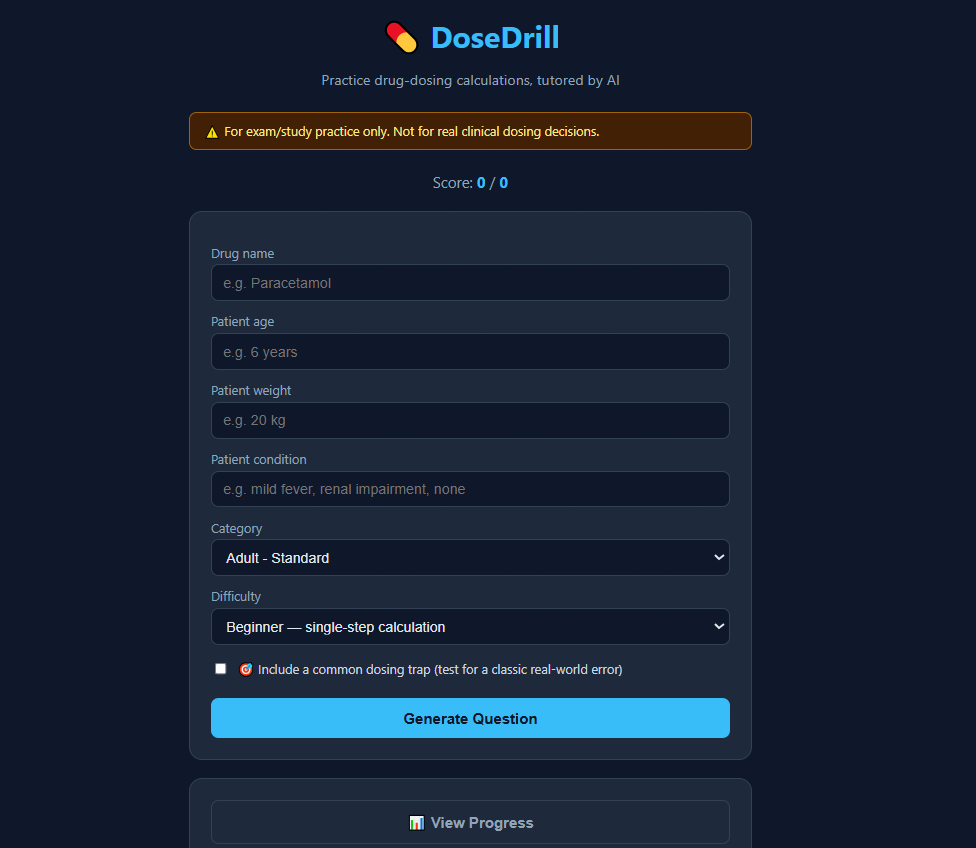
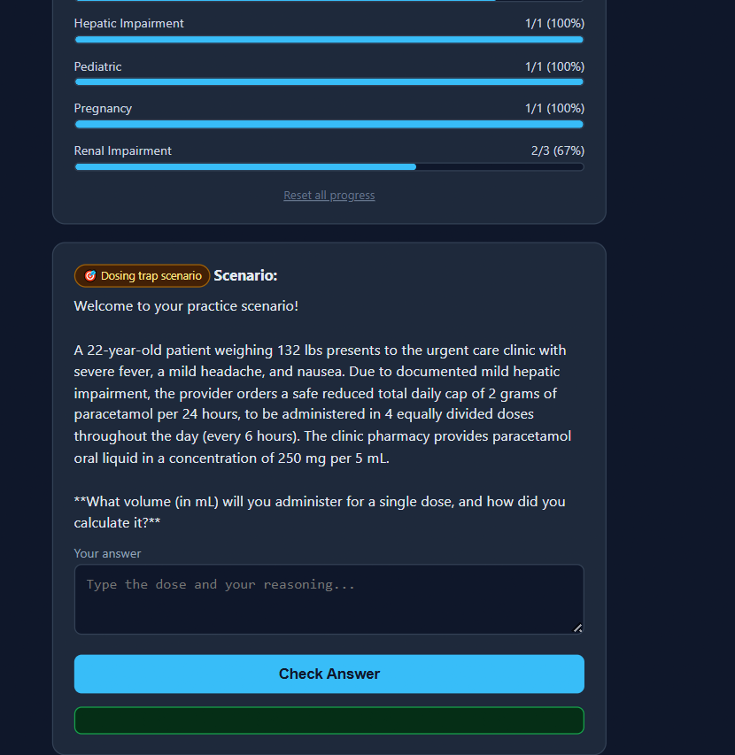
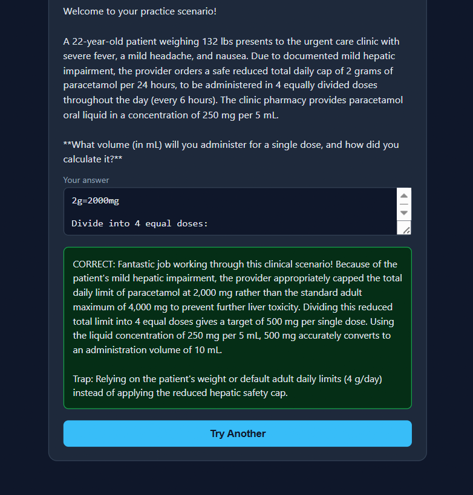
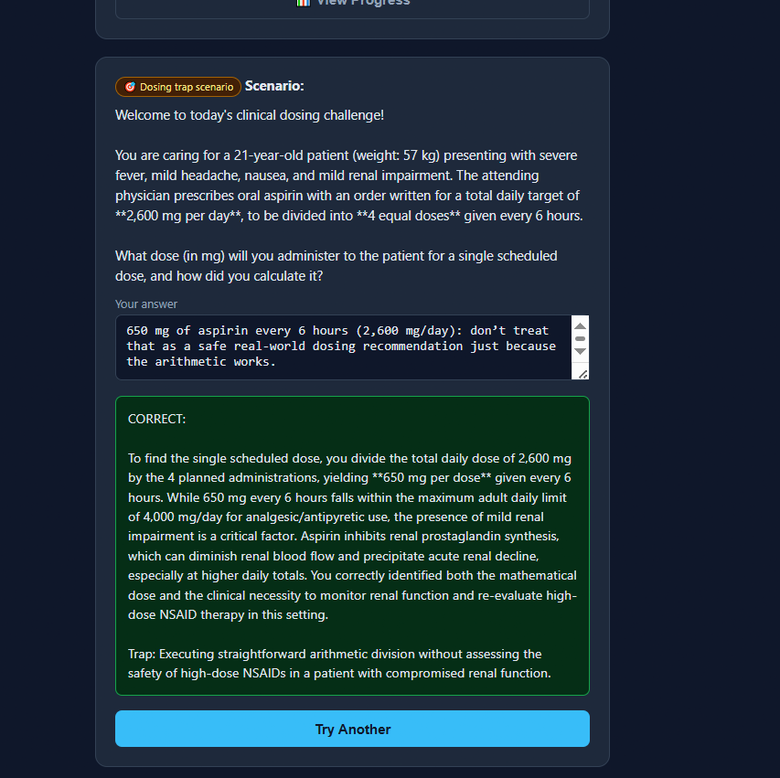
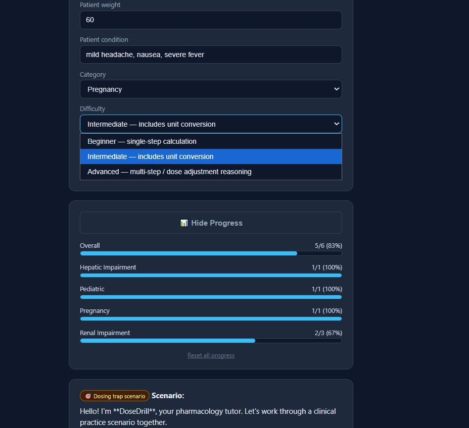
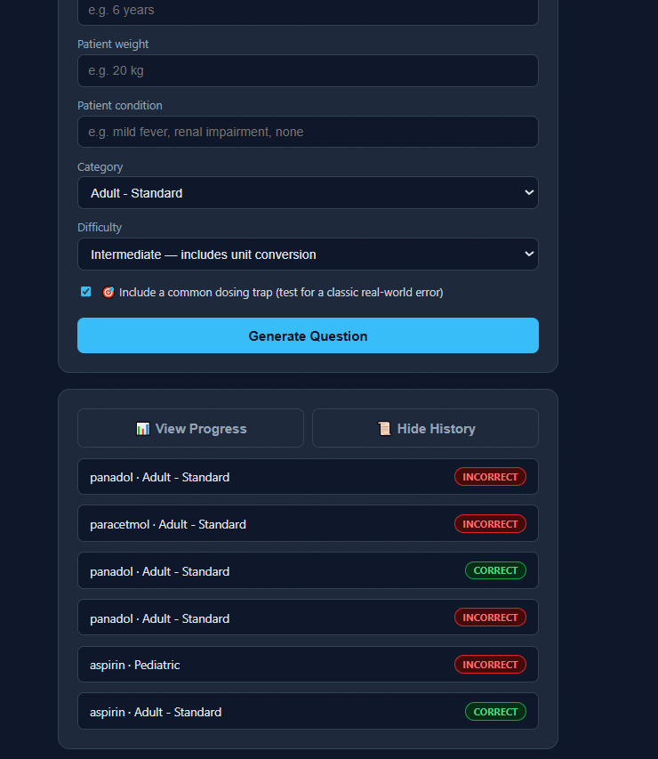

# 💊 DoseDrill

**AI-tutored practice for drug-dosing calculations.**

DoseDrill generates realistic, tailored drug-dosing scenarios and grades your calculations with step-by-step feedback — built for medical, nursing, and pharmacy students who want unlimited, judgment-free practice.

🔗 **Live app:** [dose-drill-six.vercel.app](https://dose-drill-six.vercel.app/)

> ⚠️ For exam/study practice only. Not for real clinical dosing decisions.

---

## Screenshots

| Main input screen | Generated scenario |
|---|---|
|  |  |

| Graded answer with explanation | Dosing trap mode |
|---|---|
|  |  |

| Progress tracking | Question history |
|---|---|
|  |  |

---

## The problem

Dosing errors are one of the most common and dangerous mistakes in clinical practice — often caused by simple things like decimal misplacement, unit confusion (mg vs. mcg), or forgetting to adjust for a patient's condition. Students get very little repeated, low-stakes practice at exactly this skill before they're doing it for real. Textbook problem sets are static, limited in number, and don't adapt to a student's weak spots.

## What DoseDrill does

1. **You enter a patient profile** — drug, age, weight, and condition.
2. **Gemini generates a realistic scenario** tailored to that patient, at a difficulty and category you choose.
3. **You calculate and submit your answer.**
4. **Gemini grades it and explains the reasoning** — whether you got it right or wrong — so every attempt is a learning moment, not just a pass/fail.

## Key features

- 🧠 **AI-generated scenarios** — powered by Google's Gemini API, every question is unique and tailored to the patient details you enter.
- 📝 **Step-by-step explanations** — every answer comes back with the correct dose and the reasoning behind it, not just "correct/incorrect."
- 🏷️ **Category tagging** — Adult, Pediatric, Renal Impairment, Hepatic Impairment, Pregnancy, and more, so scenarios reflect real clinical variation.
- 📊 **Difficulty levels** — Beginner (single-step), Intermediate (unit conversion), Advanced (multi-step / dose-adjustment reasoning).
- 🎯 **Dosing trap mode** — optionally, the AI deliberately builds a scenario around a classic real-world dosing error (decimal slips, mg/mcg mix-ups, adult-dose-on-a-child, etc.) and reveals what the trap was after grading — training students to spot the mistakes that actually happen in practice.
- 💾 **Persistent progress tracking** — your score and accuracy are saved on your device (via `localStorage`) across sessions, with a breakdown of accuracy *by category* so you can see exactly where you're weak.
- 📜 **Question history** — every past scenario is saved and browsable, so you can revisit any previous question, your answer, and the AI's full explanation at any time.

## Tech stack

- **Frontend:** Vanilla HTML/CSS/JS (no framework — kept deliberately lightweight)
- **Backend:** Vercel Serverless Function (`/api/dosedrill.js`)
- **AI:** Google Gemini API
- **Hosting:** Vercel
- **Storage:** Browser `localStorage` for progress history (no database required)

## Project structure

```
DoseDrill/
├── Api/
│   └── dosedrill.js     # Serverless function — talks to the Gemini API
├── Public/
│   └── index.html       # Frontend UI + client-side logic
├── package.json
└── vercel.json
```

## Running it yourself

1. Clone the repo
2. Get a free Gemini API key from [Google AI Studio](https://aistudio.google.com/apikey)
3. In your Vercel project settings, add an environment variable: `GEMINI_API_KEY`
4. Deploy with Vercel (or run locally with the Vercel CLI: `vercel dev`)

## Team

Built by sisters **Zainab Hassan** and **Ayesha Hassan** ([@Zainab-Hassan928](https://github.com/Zainab-Hassan928)) — originally created as an AI course final project, since expanded with progress tracking, difficulty tiers, and dosing-trap mode for hackathon submission.

## Disclaimer

DoseDrill is an educational study tool only. It is **not** intended for, and must never be used for, real clinical dosing decisions. Always defer to verified clinical references and licensed professionals for actual patient care.

